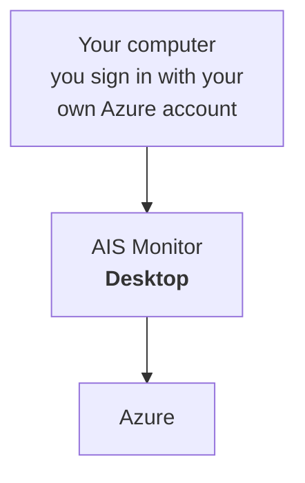
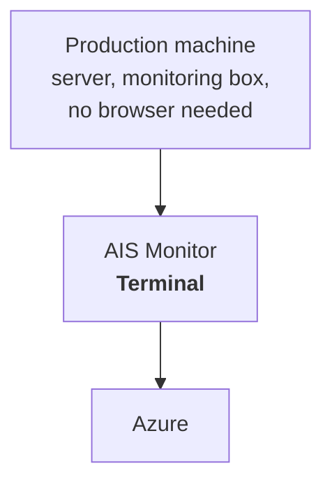
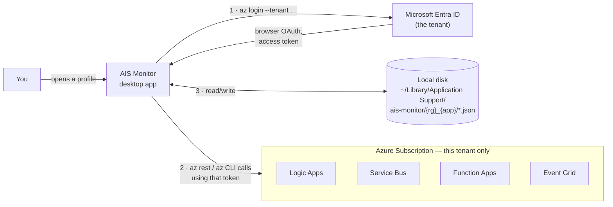
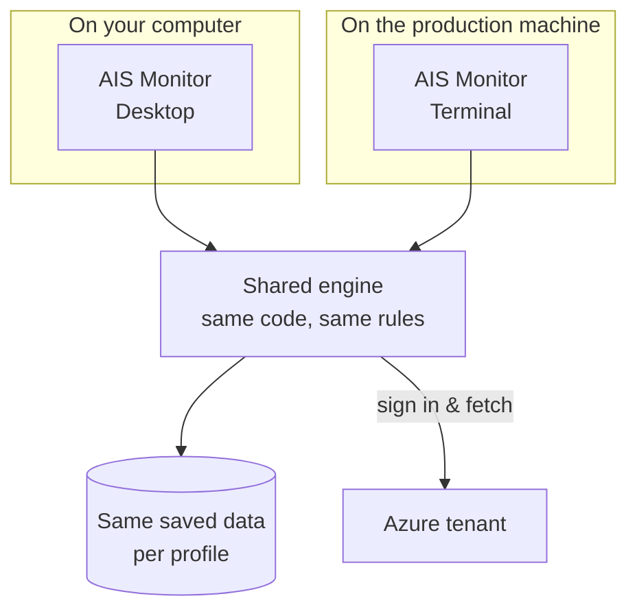
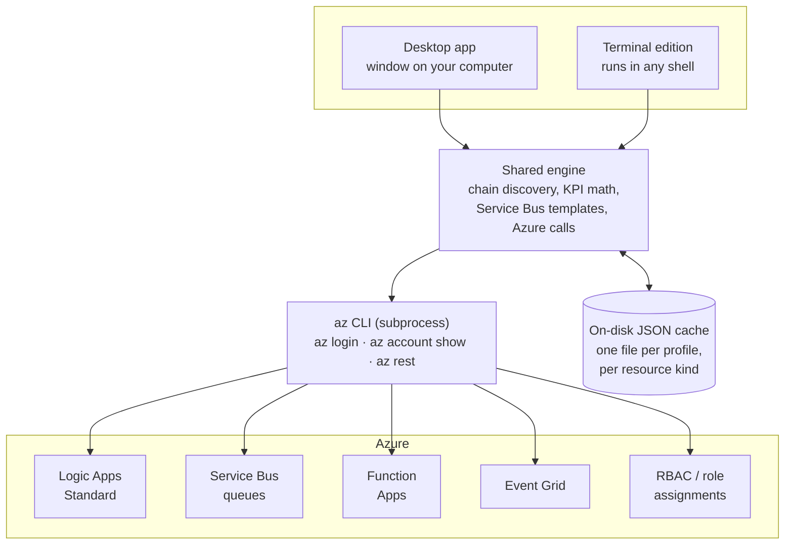

# AIS Monitor — Architecture

How the app talks to Azure, what it caches, and how the desktop app differs
from the terminal edition.

## How it runs





Same app, two places to run it: on your own laptop while you're signed in,
or on a server watching things around the clock. The rest of this doc goes
into how each one actually talks to Azure.

## What it does

AIS Monitor discovers **Azure Logic Apps Standard workflow chains** —
sequences of workflows wired together by Service Bus queues and Event Grid
triggers — and shows their run history, success rate, and failure streaks.
It can also trigger a workflow manually, browse Function Apps, assign RBAC
roles, and check resource health. It never re-implements Azure auth or APIs
itself: it shells out to the `az` CLI that's already installed and logged in
on your machine.

## Overview: desktop app and one Azure tenant



Every profile repeats this same loop against its own tenant: authenticate,
call Azure, cache the result locally. Nothing is shared between tenants
except the app binary itself.

## Under the hood: same logic, same cache



Point both at the same profile and they read and write the exact same
saved data, so a chain checked from the production machine shows up
already-fresh next time someone opens the desktop app on their laptop.

## Architecture



Both editions link against the same shared engine — same Azure calls, same
cache files on disk — so switching between the desktop window and the
terminal mid-session shows the same data.

## Login

There's no custom auth code. On startup the app runs `az account show` and
`az account get-access-token` to check for a live session. If none exists,
it shells out to `az login` (opening your browser for OAuth), optionally
scoped to a specific tenant with `--tenant`. The terminal edition also
supports `az login --use-device-code` for headless machines with no browser.

## Caching

Every panel — Function Apps, chain health/KPI history, resource health —
writes its own small JSON file to disk after each Azure round-trip. That's
what makes the app open instantly and show data before the first `az` call
even returns: it paints the cached snapshot, then refreshes underneath.
Health history is capped at the last 30 runs per chain, just enough for a
sparkline.

### Cached data, for real

Two examples straight from the schemas in `src/services/`. Both live in the
same per-profile folder, one JSON file per resource kind.

**`functions_cache.json`** — Function Apps tab snapshot

```json
{
  "func_apps": [
    { "name": "ais-ingest-fn",
      "state": "Running",
      "location": "westeurope" }
  ],
  "functions": [
    ["ais-ingest-fn", [
      { "name": "ProcessBatch",
        "trigger_type": "serviceBusTrigger" }
    ]]
  ],
  "app_insights_name": "ais-ingest-ai",
  "metrics": [
    ["ais-ingest-fn", [
      { "name": "Requests", "value": 812 }
    ]]
  ],
  "last_fetched": 1755000420
}
```

**`health_cache.json`** — last known KPI per chain

```json
{
  "health": {
    "invoice-intake-chain": {
      "success_rate": 97.5,
      "dead_letters": 2,
      "stuck_count": 0,
      "failure_streak": 0
    },
    "claims-sync-chain": {
      "success_rate": 61.0,
      "dead_letters": 14,
      "stuck_count": 3,
      "failure_streak": 5
    }
  },
  "last_checked": {
    "invoice-intake-chain": 1755000420,
    "claims-sync-chain": 1755000180
  }
}
```

### Health data it produces

On top of the latest snapshot above, every "Check all" run appends one point
to a bounded 30-point history per chain (`history.json`) — that's what draws
the sparkline next to each chain in the list:

**`history.json`** — `claims-sync-chain`, most recent 3 of 30 points

```json
{
  "chains": {
    "claims-sync-chain": [
      { "ts": 1754996580, "success_rate": 88.0, "dead_letters": 1,  "stuck_count": 0, "failure_streak": 0 },
      { "ts": 1754998380, "success_rate": 74.0, "dead_letters": 6,  "stuck_count": 1, "failure_streak": 2 },
      { "ts": 1755000180, "success_rate": 61.0, "dead_letters": 14, "stuck_count": 3, "failure_streak": 5 }
    ]
  }
}
```

Read top to bottom, this is the chain visibly degrading — success rate
sliding, dead letters piling up, failure streak climbing — exactly the trend
the sparkline and KPI badges are built to surface at a glance.

## Tenant & subscription separation

Each saved connection is a **profile** — subscription, resource group, app
name, Service Bus namespace, and tenant, bundled together. Opening a profile
re-runs `az login` scoped to that profile's tenant, and each profile gets
its own cache directory on disk. Nothing from one tenant's cache can leak
into another's view — switching profiles is a clean context switch, not a
filter on shared data.

## Desktop app vs. terminal edition

| | Desktop | Terminal |
|---|---|---|
| Interface | Native window, mouse-driven, tabs and panels | Runs inside any terminal, keyboard-driven |
| Trigger a workflow with custom JSON payload | ✓ | — |
| Message-template-driven Service Bus sends | ✓ | — |
| RBAC / Event Grid / App Config drift panels | ✓ | — |
| Chain health, KPIs, run history | ✓ | ✓ |
| Headless login (device code, no browser) | — | ✓ |
| Good for | Day-to-day investigation, triggering, RBAC changes | SSH boxes, CI dashboards, quick watch loops over a chain |

---
Based on the current state of the `ais-monitor` repository.
